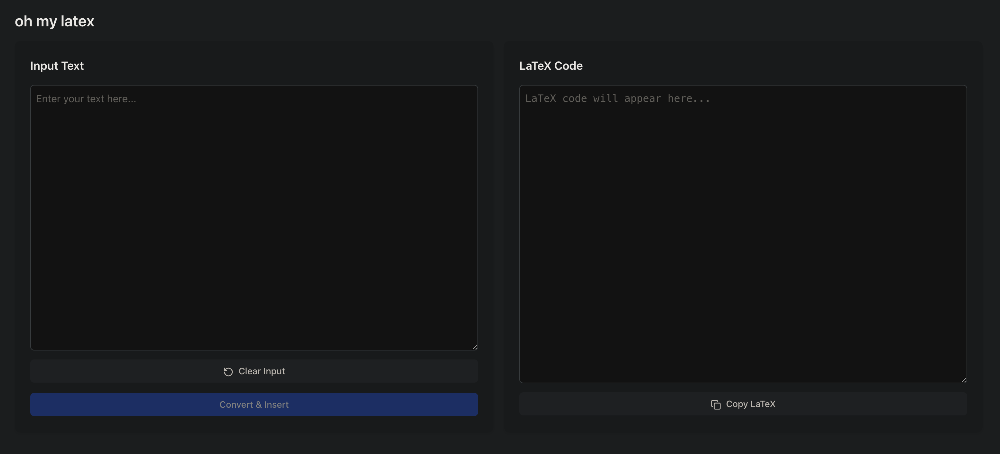
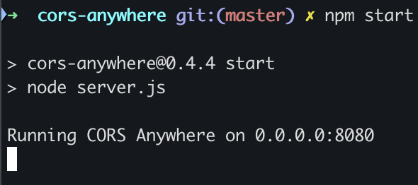
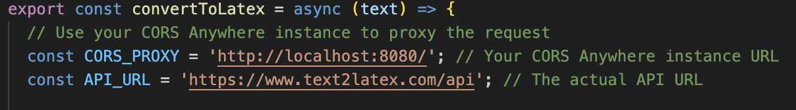

# oh my latex

Oh My LaTeX is a React application that converts plain text to LaTeX format using API integration. It allows users to add the converted LaTeX code to the existing LaTeX code in the pointer location within the editor. The app features a dual-pane interface with text input and LaTeX output, where users can enter text and add it to the LaTeX editor. The project aims to enable users to incrementally build a document by adding LaTeX code and eventually copy the final LaTeX code to render a document.

 


## 🚀 Quick Start

### Prerequisites
- Node.js (v14.0.0 or higher)
- npm (v6.0.0 or higher)

### API USED

The project uses the `text2latex.com` API that is used in the text2latex.com website. The API returns the latex code for the given plain text. This is not a public API and does not have any documentation.  The API had CORS restrictions, so I had to start a proxy server to handle CORS restrictions. That is done with the help of the cors-anywhere GitHub repository. The details regarding this are presented below in   the `API Integration and CORS Restriction` section. 

### AI-Generated Code
The majority of the code in this repository has been developed using LLMs, mostly Claude and ChatGPT. Claude helped in defining all the components of the React app, and ChatGPT helped resolve error with CORS. 

### Installation

1. Clone the repository 
```bash
git clone https://github.com/timsinashok/oh-my-latex.git
cd oh-my-latex
```

2. Install the required dependencies for the app from package.json:
```bash
npm install 
```

3. Initialize Tailwind CSS:
```bash
npx tailwindcss init
```

### Project Structure
```
oh-my-latex/
├── public/
├── src/
│   ├── components/
│   │  ├── LatexConverter.jsx
│   │  ├── ErrorAlert.jsx
│   │  ├── TextArea.jsx
│   │  ├── Action Button.jsx
│   │  └── ConvertButton.jsx
│   ├── services/
│   │   └── api.js
│   ├── App.jsx
│   ├── index.jsx
│   └── index.css
├── package.json
├── README.md
└── tailwind.config.js

```

# Running the Application

## 1. API Integration and CORS Restrictions
This application uses the latex2text.com API for text-to-LaTeX conversion. However, due to CORS restrictions, a custom server is used to bypass these restrictions. The custom server is hosted in a separate repository.

To use the custom server, follow these steps:

Clone the custom server repository:
``` bash
git clone https://github.com/Rob--W/cors-anywhere.git
```

Navigate to the project directory:
```
cd cors-anywhere
```

Install the dependencies:
```
npm install
```
Start the server:

```
npm start
```
The server will be available at http://localhost:8080. Make sure to update the API endpoint in the Oh My LaTeX application to point to your custom server.

 

You can update it in the `CROS_PROXY` variable here in the file `/src/services/api.jsx`:

 

 Now after resolving CROS restrictions, the app is ready to run. 

## 2. Running the platform
1. Start the development server:
```bash
npm start
```

2. Open your browser and navigate to:
```
http://localhost:3000
```

## 🔧 Features

- **Text to LaTeX Conversion**: Convert plain text to LaTeX format
- **Append to existing latex**: Converted latex can be appended to pre-existing latex code
- **Cursor Position Support**: Insert LaTeX at the cursor position in the editor
- **Copy to Clipboard**: Easily copy the generated LaTeX code
- **Error Handling**: Clear error messages for failed conversions
- **Loading States**: Visual feedback during conversion process


## 📝 Usage

1. Enter your text in the left panel
2. Click "Convert & Insert" to convert the text to LaTeX and enter at the cursor position in the latex tab
3. The converted LaTeX code appears in the right panel
4. Use the copy button to copy the LaTeX code to the clipboard


## 🔍 Error Handling

The app handles various error scenarios:
- API connection failures
- Conversion errors

Error messages are displayed in a dismissible alert at the top of the page.

## 💡 Tips

1. For best results, enter plain text without special formatting
2. Use the cursor position feature to insert LaTeX at specific locations
3. Check the console for detailed error messages during development
4. Use environment variables for API configuration


## 🤝 Contributing

1. Fork the repository
2. Create a feature branch
3. Commit your changes
4. Push to the branch
5. Open a Pull Request

